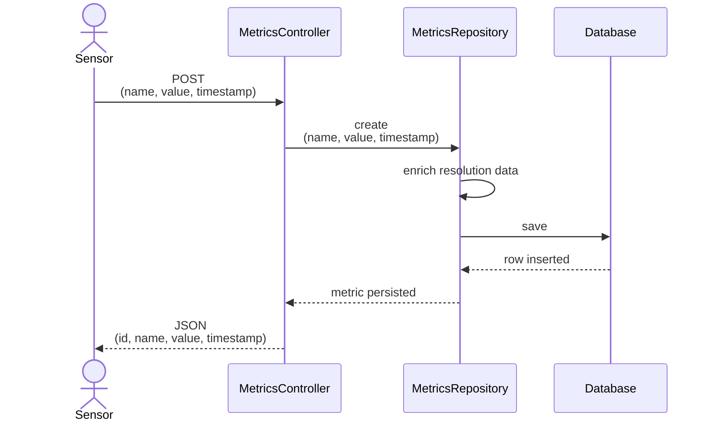
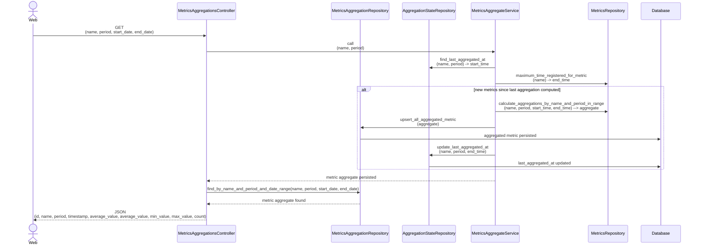

# README

## Getting started with Rails API
- This project was bootstrapped with [Create Rails API](https://guides.rubyonrails.org/api_app.html).
```sh
rails new metrics-api --api --database=postgresql --skip-git
```
- Create Dockerfile to start Rails server
- Create Docker compose to connect database to the server, so server accept connections when running locally

## Documenting Ruby on Rails APIs
To document your routes with OpenAPI in a Rails application, you can use the rswag gem. This tool integrates Swagger with Rails, allowing you to generate and maintain your API documentation efficiently.

Steps:
1. Add gems to Gemfile
```ruby
gem 'rspec-rails'
gem 'rswag'
```
1. Next, run the following commands:
```sh
bundle install
rails g rspec:install
rails g rswag:install
```

3. You should have the following files added to your repository, along with new routes added to the `routes.rb` file.
   - create  config/initializers/rswag_api.rb
   - add route  mount Rswag::Api::Engine => '/api-docs'
   - create  config/initializers/rswag_ui.rb
   - radd route  mount Rswag::Ui::Engine => '/api-docs'
   - create spec/swagger_helper.rb
   - create spec/rails_helper.rb
   - create spec/spec_helper.rb
4. Generate the swagger spec files within spec/requests for our controllers by running
```sh
rails generate rspec:swagger MetricsController
rails generate rspec:swagger MetricsAggregationsController
```
5. Generate the actual swagger docs that will be used for the swagger UI. Remember to create all necessary databases and run your pending migration.
```sh
rake rswag:specs:swaggerize
```
Note: It seems that as soon as rswag is loaded (uses Rspec), the Minitest function test and some others gets unset, leading to failure (cannot load test_helper.rb) when running the above command.So, before running the command rename test/test_helper.rb to test/test_helper.bk
6. Once successful you should have a `swagger.yaml` file, run your rails server rails s and go to the URL and add /api-docs and behold the Swagger UI documentation of all endpoints for the yours controller --> http://localhost:3000/api-docs

## Sequence Diagram
### Posting path


### Fetching path


